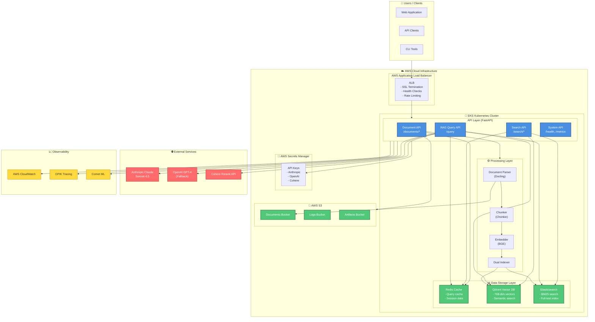

# System Architecture Overview

This diagram shows the high-level architecture of the Hybrid Search RAG system using a C4-style flowchart.

## Key Components

### API Layer
- **FastAPI Framework**: Async REST API with automatic OpenAPI documentation
- **Document Management**: Upload, ingest, retrieve, delete operations
- **Search Endpoints**: Semantic, lexical, and hybrid search
- **RAG Query**: Main question-answering endpoint
- **System Health**: Monitoring and metrics endpoints

### Data Storage
- **Redis**: L1 cache for queries, sessions, and frequently accessed data
- **Qdrant**: Vector database for semantic search (HNSW index, cosine similarity)
- **Elasticsearch**: Full-text search with BM25 algorithm

### Processing Pipeline
- **Docling Parser**: Extracts text, equations, tables, figures from PDFs/DOCX
- **Chonkie Chunker**: Multiple strategies (Token, Semantic, SDPM, Academic)
- **BGE Embedder**: Generates 768-dimensional embeddings
- **Dual Indexer**: Indexes to both Qdrant and Elasticsearch in parallel

### External Services
- **Claude Sonnet 4.5**: Primary LLM for answer generation
- **GPT-4**: Fallback LLM when Claude is unavailable
- **Cohere Rerank**: Semantic reranking of search results

### Observability
- **CloudWatch**: Metrics, logs, and alarms
- **OPIK**: Distributed tracing for RAG pipeline
- **Comet ML**: Experiment tracking and A/B testing
