# Document Ingestion Workflow

This diagram shows the complete document processing pipeline from upload to indexing.

```mermaid
flowchart TD
    Start([User uploads document]) --> Upload[POST /api/v1/documents/upload]

    Upload --> SaveS3[Save to S3<br/>s3://documents/raw/]
    SaveS3 --> ReturnID[Return document_id]

    ReturnID --> Ingest[POST /api/v1/documents/ingest<br/>with document_id]

    Ingest --> CheckCache{Check Redis<br/>cache}
    CheckCache -->|Cached| ReturnCached[Return cached result]
    CheckCache -->|Not cached| FetchS3[Fetch from S3]

    FetchS3 --> Parse[Parse Document<br/>Docling Parser]

    subgraph ParsingPhase["📄 Parsing Phase"]
        Parse --> DetectType{Document<br/>Type?}
        DetectType -->|PDF| ParsePDF[Extract:<br/>- Text<br/>- Equations LaTeX<br/>- Tables<br/>- Figures]
        DetectType -->|DOCX| ParseDOCX[Extract:<br/>- Text<br/>- Formatting<br/>- Metadata]
        DetectType -->|HTML| ParseHTML[Extract:<br/>- Clean HTML<br/>- Structured data]
        DetectType -->|TXT/MD| ParseText[Extract:<br/>- Plain text]

        ParsePDF --> ExtractMeta
        ParseDOCX --> ExtractMeta
        ParseHTML --> ExtractMeta
        ParseText --> ExtractMeta

        ExtractMeta[Extract Metadata:<br/>- Title<br/>- Authors<br/>- DOI/arXiv ID<br/>- Abstract<br/>- References]
    end

    ExtractMeta --> Chunk[Chunk Content<br/>Chonkie]

    subgraph ChunkingPhase["✂️ Chunking Phase"]
        Chunk --> SelectStrategy{Select<br/>Strategy}
        SelectStrategy -->|Long papers<br/>>10k tokens| SDPM[SDPM Chunker<br/>Sentence-based]
        SelectStrategy -->|Academic<br/>papers| Academic[Academic Chunker<br/>Section-aware]
        SelectStrategy -->|Standard<br/>docs| Semantic[Semantic Chunker<br/>Meaning boundaries]
        SelectStrategy -->|Fallback| Token[Token Chunker<br/>Fixed size + overlap]

        SDPM --> ValidateChunks
        Academic --> ValidateChunks
        Semantic --> ValidateChunks
        Token --> ValidateChunks

        ValidateChunks[Validate Chunks:<br/>- Size limits<br/>- Overlap OK<br/>- Integrity check]
    end

    ValidateChunks --> Embed[Generate Embeddings<br/>BGE Model]

    subgraph EmbeddingPhase["🔢 Embedding Phase"]
        Embed --> BatchProcess[Batch Process<br/>32 chunks/batch]
        BatchProcess --> GPU{GPU<br/>Available?}
        GPU -->|Yes| FP16[FP16 Computation<br/>Fast]
        GPU -->|No| CPU[CPU Computation<br/>Slower]

        FP16 --> Normalize
        CPU --> Normalize

        Normalize[L2 Normalization<br/>768-dim vectors]
    end

    Normalize --> Index[Dual Indexing]

    subgraph IndexingPhase["📇 Indexing Phase"]
        Index --> Parallel{Parallel<br/>Indexing}

        Parallel -->|Thread 1| IndexQdrant[Index to Qdrant:<br/>- Collection create/update<br/>- HNSW index<br/>- Metadata tags]
        Parallel -->|Thread 2| IndexElastic[Index to Elasticsearch:<br/>- Create/update doc<br/>- BM25 index<br/>- Field boosting]

        IndexQdrant --> QdrantStatus{Success?}
        IndexElastic --> ElasticStatus{Success?}

        QdrantStatus -->|No| RetryQ[Retry Qdrant<br/>3 attempts]
        ElasticStatus -->|No| RetryE[Retry Elasticsearch<br/>3 attempts]

        RetryQ --> QdrantStatus
        RetryE --> ElasticStatus

        QdrantStatus -->|Yes| CombineStatus
        ElasticStatus -->|Yes| CombineStatus

        CombineStatus[Combine Results]
    end

    CombineStatus --> Cache[Cache Result<br/>Redis, 24h TTL]
    Cache --> SaveMeta[Save Metadata<br/>to Database]
    SaveMeta --> LogMetrics[Log Metrics:<br/>- Processing time<br/>- Chunk count<br/>- Embedding time]

    LogMetrics --> Success([Return Success<br/>Status + Metadata])

    RetryQ -->|Failed| Error
    RetryE -->|Failed| Error

    Error([Return Error<br/>Status + Details])

    %% Styling
    classDef phase fill:#E3F2FD,stroke:#1976D2,stroke-width:2px
    classDef process fill:#C8E6C9,stroke:#388E3C,stroke-width:2px
    classDef decision fill:#FFF9C4,stroke:#F57C00,stroke-width:2px
    classDef storage fill:#F8BBD0,stroke:#C2185B,stroke-width:2px
    classDef success fill:#A5D6A7,stroke:#2E7D32,stroke-width:3px
    classDef error fill:#EF9A9A,stroke:#C62828,stroke-width:3px

    class ParsingPhase,ChunkingPhase,EmbeddingPhase,IndexingPhase phase
    class Parse,Chunk,Embed,Index,Cache process
    class CheckCache,DetectType,SelectStrategy,GPU,Parallel,QdrantStatus,ElasticStatus decision
    class SaveS3,FetchS3,IndexQdrant,IndexElastic,SaveMeta storage
    class Success success
    class Error error
```

## Processing Stages

### 1. Upload Stage
- User uploads document via API
- File saved to S3 (raw bucket)
- Document ID generated and returned

### 2. Parsing Stage
- **Docling Parser** processes document
- Format-specific extraction:
  - PDF: Text, LaTeX equations, tables, figures
  - DOCX: Text with formatting, metadata
  - HTML: Clean structured data
  - TXT/Markdown: Plain text
- Metadata extraction: Title, authors, DOI, abstract, references

### 3. Chunking Stage
- **Strategy Selection** based on document characteristics:
  - Long papers (>10k tokens): SDPM (Sentence-based)
  - Academic papers: Academic (Section-aware)
  - Standard documents: Semantic (Meaning boundaries)
  - Fallback: Token (Fixed size with overlap)
- **Validation**: Check size limits, overlap, integrity

### 4. Embedding Stage
- **BGE Model** (BAAI/bge-base-en-v1.5)
- Batch processing: 32 chunks per batch
- GPU acceleration with FP16 when available
- L2 normalization: 768-dimensional vectors

### 5. Indexing Stage
- **Parallel Dual Indexing**:
  - **Qdrant**: Vector search with HNSW index
  - **Elasticsearch**: Full-text search with BM25
- Retry logic: 3 attempts per index
- Metadata enrichment

### 6. Finalization
- Cache results in Redis (24h TTL)
- Save metadata to database
- Log processing metrics
- Return success status

## Error Handling
- Failed parsing → Return error with details
- Failed chunking → Fallback to Token chunker
- Failed indexing → Retry up to 3 times
- Partial failure → Log warning, continue with available indices
