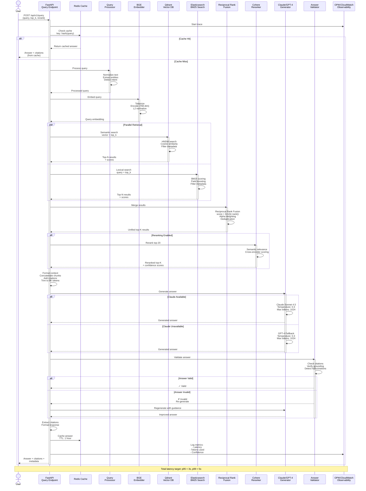

# RAG Query Pipeline Workflow

This diagram shows the complete RAG (Retrieval-Augmented Generation) query processing pipeline.



## Pipeline Stages

### 1. Request Reception
- User sends query via REST API
- Optional parameters: `top_k`, `rerank`, `filters`
- Distributed tracing started

### 2. Cache Check
- **Cache Hit**: Return cached answer immediately (< 10ms)
- **Cache Miss**: Proceed with full pipeline
- Cache key: Hash of normalized query + parameters

### 3. Query Processing
- **Normalization**: Lowercase, remove special chars, lemmatization
- **Entity Extraction**: Identify key terms, authors, concepts
- **Intent Detection**: Classify query type (factual, comparative, analytical)

### 4. Query Embedding
- **BGE Embedder**: Generate 768-dimensional vector
- **Normalization**: L2 norm for cosine similarity
- **Batching**: Process multiple queries if available

### 5. Parallel Retrieval
Two searches run simultaneously:

**Semantic Search (Qdrant)**:
- Vector similarity search (HNSW algorithm)
- Cosine similarity metric
- Metadata filtering (optional)
- Top-N candidates

**Lexical Search (Elasticsearch)**:
- BM25 full-text search
- Field boosting (title: 2.0x, abstract: 1.5x)
- Standard analyzer with stop words
- Top-N candidates

### 6. Result Fusion
**Reciprocal Rank Fusion (RRF)**:
```
score(doc) = Σ(1 / (k + rank))
```
Where:
- `k = 60` (constant)
- `rank` = position in result list

**Alpha Weighting**:
```
final_score = α × semantic_score + (1-α) × lexical_score
```
Where `α = 0.5` (configurable)

**Deduplication**: Remove duplicate chunks

### 7. Reranking (Optional)
- **Cohere Rerank API**: Cross-encoder model
- Input: Top-20 candidates
- Output: Top-K reranked results with confidence scores
- Improves precision by 15-25%

### 8. Context Formation
- Concatenate selected chunks
- Insert citation markers [1], [2], [3]
- Trim to fit LLM context window (max 8K tokens)
- Preserve chunk boundaries

### 9. Answer Generation
**Primary: Claude Sonnet 4.5**
- Temperature: 0.3 (factual, low creativity)
- Max tokens: 1024
- System prompt: Academic research assistant

**Fallback: GPT-4**
- Automatic failover on Claude errors
- Same parameters and prompt
- Circuit breaker pattern

### 10. Answer Validation
- **Citation Check**: Verify all claims have citations
- **Grounding Check**: Ensure answer is supported by context
- **Hallucination Detection**: Flag unsupported statements
- **Regeneration**: If invalid, regenerate with additional guidance

### 11. Response Formatting
- Extract citation metadata
- Format answer with markdown
- Add confidence score
- Include metadata (latency, token usage)

### 12. Caching & Logging
- **Cache**: Store in Redis (1 hour TTL)
- **Metrics**: Log to CloudWatch and OPIK
  - End-to-end latency
  - Component latencies
  - Token usage
  - Confidence scores
  - Cache hit rate

## Performance Targets
- **p50 latency**: < 1.5s
- **p95 latency**: < 3s
- **p99 latency**: < 5s
- **Cache hit rate**: 60-70%
- **Accuracy**: > 85% (human evaluation)
