# CI/CD Pipeline Workflow

This diagram shows the complete Continuous Integration and Continuous Deployment pipeline using GitHub Actions.

```mermaid
flowchart TB
    subgraph Triggers["🎯 Triggers"]
        PR[Pull Request<br/>to main/develop]
        Push[Push to<br/>main/develop]
        Release[Release Tag<br/>v*.*.*]
    end

    PR --> CI
    Push --> CI

    subgraph CI["🔧 CI Pipeline - Continuous Integration"]
        direction TB

        subgraph Parallel1["Parallel Jobs (Stage 1)"]
            CodeQuality[Code Quality<br/>────────<br/>✓ Ruff linter<br/>✓ Ruff formatter<br/>✓ MyPy types<br/>✓ isort imports]

            Security[Security Scan<br/>────────<br/>✓ Bandit<br/>✓ Safety check<br/>✓ Dependency audit]
        end

        subgraph Parallel2["Parallel Jobs (Stage 2)"]
            UnitTests[Unit Tests<br/>────────<br/>✓ pytest<br/>✓ Coverage >80%<br/>✓ JUnit XML<br/><br/>Services:<br/>• Redis]

            IntegrationTests[Integration Tests<br/>────────<br/>✓ pytest<br/>✓ End-to-end<br/>✓ API tests<br/><br/>Services:<br/>• Qdrant<br/>• Elasticsearch<br/>• Redis]
        end

        CodeQuality --> BuildCheck{All checks<br/>passed?}
        Security --> BuildCheck

        BuildCheck -->|Yes| Parallel2
        BuildCheck -->|No| FailCI[❌ CI Failed]

        UnitTests --> DockerBuild{Ready for<br/>Docker?}
        IntegrationTests --> DockerBuild

        subgraph DockerStage["Docker Build & Scan"]
            DockerBuild -->|Yes| BuildImage[Build Docker Image<br/>────────<br/>Multi-stage build<br/>Tag: ci-SHA]

            BuildImage --> TrivyScan[Trivy Security Scan<br/>────────<br/>Scan for vulnerabilities<br/>CRITICAL + HIGH only]

            TrivyScan --> ScanResults{Vulnerabilities<br/>found?}

            ScanResults -->|Critical| FailCI
            ScanResults -->|None/Low| PassCI[✅ CI Passed]
        end

        DockerBuild -->|No| FailCI
    end

    PassCI --> CDDecision{Deployment<br/>target?}

    CDDecision -->|main branch| Staging
    CDDecision -->|release tag| Production
    CDDecision -->|develop/PR| Skip[Skip deployment]

    subgraph CD_Staging["🚀 CD Pipeline - Staging"]
        Staging[Deploy to Staging]

        Staging --> TagImage1[Tag Image<br/>staging-latest]
        TagImage1 --> PushECR1[Push to ECR<br/>staging registry]
        PushECR1 --> UpdateK8s1[Update K8s<br/>Deployment<br/>────────<br/>kubectl set image]
        UpdateK8s1 --> WaitRollout1[Wait for Rollout<br/>────────<br/>Max 5 minutes]

        WaitRollout1 --> HealthCheck1{Health checks<br/>passed?}
        HealthCheck1 -->|Yes| SmokeTests1[Run Smoke Tests<br/>────────<br/>✓ API health<br/>✓ Basic query<br/>✓ Document upload]
        HealthCheck1 -->|No| Rollback1[Rollback<br/>to previous version]

        SmokeTests1 --> TestResults1{Tests<br/>passed?}
        TestResults1 -->|Yes| NotifySuccess1[✅ Notify Success<br/>Slack/Email]
        TestResults1 -->|No| Rollback1

        Rollback1 --> NotifyFailure1[❌ Notify Failure<br/>Slack/Email]
    end

    subgraph CD_Production["🌍 CD Pipeline - Production"]
        Production[Deploy to Production]

        Production --> ManualApproval{Manual<br/>Approval<br/>Required}

        ManualApproval -->|Approved| TagImage2[Tag Image<br/>────────<br/>prod-latest<br/>prod-v1.2.3]
        ManualApproval -->|Rejected| CancelDeploy[❌ Deployment<br/>Cancelled]

        TagImage2 --> PushECR2[Push to ECR<br/>production registry]

        PushECR2 --> BlueGreen{Deployment<br/>Strategy}

        BlueGreen -->|Blue-Green| DeployGreen[Deploy to Green<br/>Environment]
        BlueGreen -->|Rolling| RollingUpdate[Rolling Update<br/>────────<br/>25% at a time<br/>Max surge: 1<br/>Max unavailable: 0]
        BlueGreen -->|Canary| CanaryDeploy[Canary Deployment<br/>────────<br/>10% traffic<br/>Monitor metrics]

        DeployGreen --> ValidateGreen[Validate Green<br/>────────<br/>Run full test suite]
        RollingUpdate --> WaitRollout2
        CanaryDeploy --> MonitorCanary[Monitor Canary<br/>────────<br/>15 min observation<br/>Error rate < 1%]

        ValidateGreen --> SwitchTraffic{Switch<br/>traffic?}
        MonitorCanary --> CanaryOK{Canary<br/>healthy?}

        SwitchTraffic -->|Yes| UpdateLB[Update Load Balancer<br/>Blue → Green]
        SwitchTraffic -->|No| Rollback2

        CanaryOK -->|Yes| ScaleCanary[Scale to 100%]
        CanaryOK -->|No| Rollback2

        UpdateLB --> WaitRollout2
        ScaleCanary --> WaitRollout2

        WaitRollout2[Wait for Rollout<br/>────────<br/>Max 10 minutes]

        WaitRollout2 --> HealthCheck2{Health checks<br/>passed?}

        HealthCheck2 -->|Yes| SmokeTests2[Run Smoke Tests +<br/>Integration Tests<br/>────────<br/>✓ All endpoints<br/>✓ RAG pipeline<br/>✓ Search quality]
        HealthCheck2 -->|No| Rollback2

        SmokeTests2 --> TestResults2{All tests<br/>passed?}

        TestResults2 -->|Yes| MonitorProd[Monitor Production<br/>────────<br/>30 min observation<br/>Error rate < 0.5%<br/>p95 latency < 3s]
        TestResults2 -->|No| Rollback2

        MonitorProd --> ProdHealthy{Production<br/>healthy?}

        ProdHealthy -->|Yes| TagRelease[Tag Release<br/>────────<br/>Create GitHub release<br/>Update changelog]
        ProdHealthy -->|No| Rollback2

        TagRelease --> NotifySuccess2[✅ Notify Success<br/>────────<br/>Slack<br/>Email<br/>PagerDuty]

        Rollback2[Rollback to Previous<br/>────────<br/>kubectl rollout undo<br/>Restore traffic]
        Rollback2 --> NotifyFailure2[❌ Notify Failure<br/>────────<br/>Slack<br/>Email<br/>PagerDuty<br/>Create incident]
    end

    Release --> Production

    %% Styling
    classDef trigger fill:#FFF9C4,stroke:#F57C00,stroke-width:2px
    classDef ci fill:#E3F2FD,stroke:#1976D2,stroke-width:2px
    classDef cd fill:#C8E6C9,stroke:#388E3C,stroke-width:2px
    classDef prod fill:#F8BBD0,stroke:#C2185B,stroke-width:2px
    classDef success fill:#A5D6A7,stroke:#2E7D32,stroke-width:3px
    classDef failure fill:#EF9A9A,stroke:#C62828,stroke-width:3px
    classDef decision fill:#FFECB3,stroke:#F57C00,stroke-width:2px

    class PR,Push,Release trigger
    class CodeQuality,Security,UnitTests,IntegrationTests,BuildImage,TrivyScan ci
    class Staging,TagImage1,PushECR1,UpdateK8s1 cd
    class Production,TagImage2,PushECR2,DeployGreen,RollingUpdate,CanaryDeploy prod
    class PassCI,NotifySuccess1,NotifySuccess2,TagRelease success
    class FailCI,Rollback1,Rollback2,NotifyFailure1,NotifyFailure2,CancelDeploy failure
    class BuildCheck,DockerBuild,ScanResults,CDDecision,HealthCheck1,HealthCheck2,TestResults1,TestResults2,ManualApproval,SwitchTraffic,CanaryOK,ProdHealthy,BlueGreen decision
```



## Pipeline Stages

### CI Pipeline

#### Stage 1: Code Quality & Security (Parallel)
**Duration**: ~2-5 minutes

**Code Quality Checks**:
- **Ruff Linter**: Check code style and common errors
- **Ruff Formatter**: Verify formatting consistency
- **MyPy**: Type checking (Python 3.12+)
- **isort**: Import ordering validation

**Security Scanning**:
- **Bandit**: Python security linter (detect common vulnerabilities)
- **Safety**: Dependency vulnerability scanner
- **Audit**: Check for known CVEs in dependencies

#### Stage 2: Testing (Parallel)
**Duration**: ~5-15 minutes

**Unit Tests**:
- **Framework**: pytest with coverage
- **Coverage Target**: > 80%
- **Services**: Redis (for cache tests)
- **Output**: JUnit XML, HTML coverage report

**Integration Tests**:
- **Framework**: pytest with real services
- **Services**: Qdrant, Elasticsearch, Redis
- **Tests**: End-to-end RAG pipeline, API endpoints, search quality
- **Timeout**: 30 minutes max

#### Stage 3: Docker Build & Scan
**Duration**: ~5-10 minutes

**Build**:
- Multi-stage Dockerfile
- Tag: `ci-{SHA}`
- Cache layers with GitHub Actions cache

**Security Scan**:
- **Trivy**: Scan for OS and dependency vulnerabilities
- **Severity**: CRITICAL and HIGH only
- **Fail on**: CRITICAL vulnerabilities
- **Upload**: SARIF results to GitHub Security

### CD Pipeline - Staging

**Trigger**: Merge to `main` branch

**Steps**:
1. **Tag Image**: `staging-latest`
2. **Push to ECR**: Staging registry
3. **Update Kubernetes**: `kubectl set image`
4. **Rollout**: Wait for new pods (max 5 min)
5. **Health Checks**: Liveness and readiness probes
6. **Smoke Tests**:
   - API health endpoint
   - Basic RAG query
   - Document upload/ingest
7. **Notification**: Slack/Email on success/failure

**Rollback**: Automatic on failure → Previous version

### CD Pipeline - Production

**Trigger**: Release tag `v*.*.*`

**Manual Approval**: Required before deployment

**Deployment Strategies**:

#### 1. Blue-Green Deployment
- Deploy to Green environment
- Run full test suite on Green
- Switch load balancer traffic: Blue → Green
- Keep Blue as rollback target
- Decommission Blue after 24h

#### 2. Rolling Update (Default)
- Update 25% of pods at a time
- **Max Surge**: 1 (1 extra pod during update)
- **Max Unavailable**: 0 (no downtime)
- Automatic rollback on failure

#### 3. Canary Deployment
- Deploy to 10% of pods
- Monitor for 15 minutes:
  - Error rate < 1%
  - p95 latency < 3s
  - No critical alerts
- If healthy: Scale to 100%
- If unhealthy: Rollback to 0%

**Post-Deployment**:
1. **Smoke Tests**: All critical endpoints
2. **Integration Tests**: Full RAG pipeline
3. **Monitoring**: 30-minute observation
   - Error rate < 0.5%
   - p95 latency < 3s
   - Memory/CPU within limits
4. **Tagging**: Create GitHub release
5. **Notification**: Slack, Email, PagerDuty

**Rollback**:
- Command: `kubectl rollout undo deployment/hybrid-rag-api`
- Automatic on test failures
- Manual trigger available
- Notification: Create incident ticket

## Configuration Files

### `.github/workflows/ci.yml`
```yaml
name: CI - Continuous Integration
on:
  pull_request:
    branches: [main, develop]
  push:
    branches: [main, develop]

jobs:
  code-quality: ...
  security: ...
  unit-tests: ...
  integration-tests: ...
  build-docker: ...
```

### `.github/workflows/cd.yml`
```yaml
name: CD - Continuous Deployment
on:
  push:
    branches: [main]
  release:
    types: [published]

jobs:
  deploy-staging: ...
  deploy-production: ...
```

## Metrics & Monitoring

**CI Metrics**:
- Build success rate
- Average build time
- Test coverage trend
- Security scan findings

**CD Metrics**:
- Deployment frequency
- Lead time for changes
- Mean time to recovery (MTTR)
- Change failure rate

**Targets**:
- CI build time: < 15 minutes
- CD staging deployment: < 10 minutes
- CD production deployment: < 30 minutes
- Deployment success rate: > 95%
